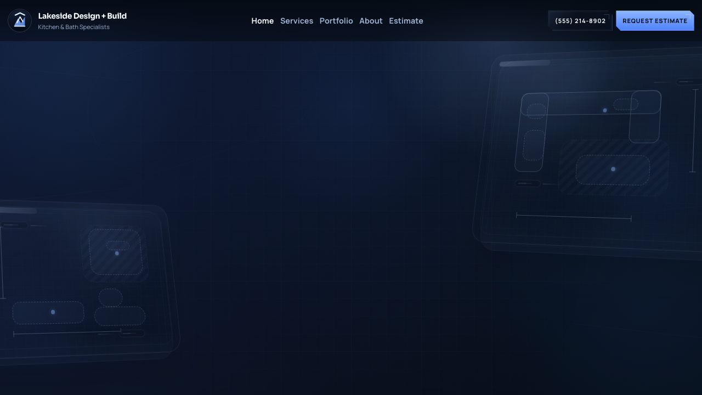
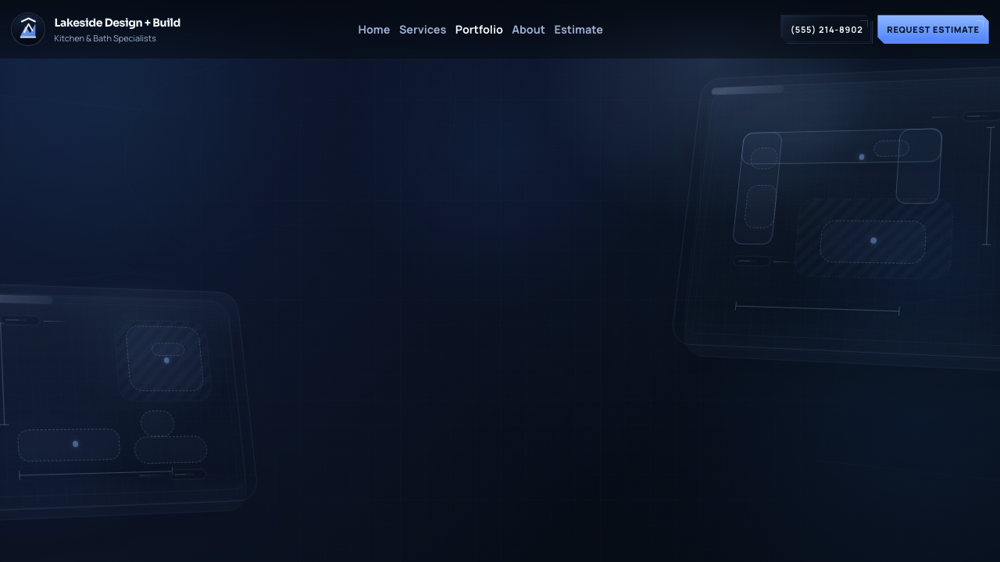
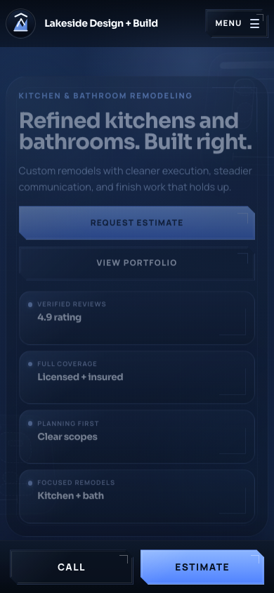

# Lakeside Design + Build

Premium multi-page kitchen and bathroom remodeling website built with Vite + React and deployed as a static site on GitHub Pages.

[Live Site](https://gryszzz.github.io/Lakeside/)

## Proprietary Notice

This repository is proprietary and is not open source.

It is published for hosting, maintenance, internal business use, and client-facing deployment only. No license is granted to copy, reuse, modify, redistribute, resell, or create derivative works from this codebase, design system, copy, branding, or media without prior written permission from the owner.

Public visibility on GitHub does not mean this project is open source.

## Preview

### Homepage



### Portfolio



### Mobile



## Site Overview

This build is positioned as a premium kitchen and bathroom remodeling brand with:

- specialist kitchen and bath messaging
- multi-page static routing for Home, Services, Portfolio, About, and Estimate
- high-end UI styling with blueprint-inspired background layers
- before-and-after presentation
- portfolio viewer interactions
- GitHub Pages deployment support
- custom domain support with `CNAME`-ready setup
- mobile-first sticky CTA behavior

## Stack

- React 18
- Vite 5
- Static multi-page HTML entries
- GitHub Actions for deploys
- GitHub Pages for hosting

## Project Structure

```text
.
|-- .github/workflows/deploy.yml
|-- about/index.html
|-- docs/readme/
|   |-- homepage-desktop.png
|   |-- homepage-mobile.png
|   `-- portfolio-desktop.png
|-- index.html
|-- package.json
|-- projects/index.html
|-- public/
|   |-- .nojekyll
|   |-- CNAME.example
|   |-- robots.txt
|   |-- sitemap.xml
|   `-- images/
|       |-- branding/
|       `-- projects/
|-- quote/index.html
|-- services/index.html
|-- src/
|   |-- components/
|   |   |-- Forms.jsx
|   |   |-- Layout.jsx
|   |   |-- Marketing.jsx
|   |   `-- Projects.jsx
|   |-- content/site.js
|   |-- main.jsx
|   |-- pages.jsx
|   |-- styles/main.css
|   `-- utils.js
`-- vite.config.js
```

## Main Edit Points

### Business content

Update [`src/content/site.js`](src/content/site.js) for:

- business name
- phone and email
- address and service area
- social links
- testimonials
- project labels and descriptions
- trust-card copy
- photo paths

### Page composition

Update [`src/pages.jsx`](src/pages.jsx) for:

- homepage sections
- page hero content
- estimate page copy
- shared CTA usage

### Reusable sections

Update [`src/components/Layout.jsx`](src/components/Layout.jsx), [`src/components/Marketing.jsx`](src/components/Marketing.jsx), and [`src/components/Projects.jsx`](src/components/Projects.jsx) for:

- header and footer
- final CTA
- services and testimonials
- portfolio grid and viewer
- before-and-after modules

### Visual system

Update [`src/styles/main.css`](src/styles/main.css) for:

- colors
- spacing
- typography
- background effects
- responsive behavior
- button treatments

### Images

Replace placeholder artwork in:

- [`public/images/projects`](public/images/projects)
- [`public/images/branding`](public/images/branding)

If you keep the same filenames, the site updates without code changes. If you rename files, update the matching references in [`src/content/site.js`](src/content/site.js).

## Local Development

Install dependencies:

```bash
npm install
```

Start the dev server:

```bash
npm run dev
```

Build production files:

```bash
npm run build
```

Preview the production build locally:

```bash
npm run preview
```

## Deployment

### GitHub Pages

This repo is already configured for GitHub Pages via [`deploy.yml`](.github/workflows/deploy.yml).

Recommended setup:

1. Push to GitHub.
2. Open `Settings -> Pages`.
3. Set `Source` to `GitHub Actions`.
4. Push to `main`.

### Base path behavior

[`vite.config.js`](vite.config.js) automatically handles:

- repo-based Pages URLs such as `https://username.github.io/repo-name/`
- custom-domain root deployment when `CUSTOM_DOMAIN=true`

Optional overrides:

- `CUSTOM_DOMAIN=true`
- `SITE_BASE=/`

### Custom domain

1. Copy [`public/CNAME.example`](public/CNAME.example) to `public/CNAME`
2. Replace it with your real domain
3. Add that same domain in GitHub Pages settings
4. Point DNS to GitHub Pages
5. Set `CUSTOM_DOMAIN=true`

[`public/.nojekyll`](public/.nojekyll) is already included.

## SEO And Static Hosting Notes

Each page has its own HTML entry:

- [`index.html`](index.html)
- [`services/index.html`](services/index.html)
- [`projects/index.html`](projects/index.html)
- [`about/index.html`](about/index.html)
- [`quote/index.html`](quote/index.html)

Also review:

- [`public/robots.txt`](public/robots.txt)
- [`public/sitemap.xml`](public/sitemap.xml)

The live estimate flow is currently direct contact by phone or email. The older static form component remains in the codebase for future use, but the public estimate path is intentionally simplified.

## Launch Checklist

Before a real launch, replace:

- business contact details
- service area locations
- project placeholders
- screenshots and social share image
- testimonial names and copy
- map/address details
- favicon and branding assets if needed
- sitemap and robots domain references
- optional `CNAME` file for custom domain use
